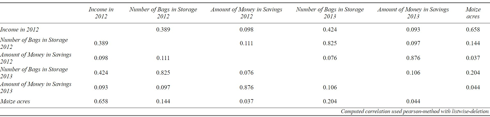

```{r results='asis', include=FALSE}

# Load necessary libraries
library(readxl)
library(dplyr)
library(tidyr)
library(ggplot2)
library(scales)
library(sjPlot)
library(corrplot)
library(rempsyc)
library(broom)
library(report)
```
```{r warning=FALSE, include=FALSE, results='asis'}

# Read the Excel file
data <- read_excel("~/One Acre Funds/Dataset/MEL_Research.xlsx")

# Display the structure of the data
str(data)

# Display summary statistics
summary(data)

# Check for missing values
colSums(is.na(data))

# Display the first few rows
head(data)
```
## Data Cleaning 
Based on the dataset provided, there are two areas where data cleaning is necessary:

1. Missing Values
2. Inconsistent Data Entries

For the missing values, some fields such as the Field Manager, Field Officer, Group Name, % Repaid , and Risky contain missing values. These missing values can skew the analysis if not properly addressed. Based on this, we identified the missing values and decided to mutate missing values with "NA".

```{r echo=TRUE, warning=FALSE, results='asis'}
data <- data %>% 
  mutate(across(c('Field Manager', 'Field Officer', 'Group Name'), ~replace_na(., "NA")))
  
```
For cases of inconsistencies, we have noticed varying inconsistencies due to errors or typos in the following columns:

1. Group category (e.g., Con, Cont, Contr, Tes, test.)
2. Number of Bags in Storage 2012 (String values instead of numeric, e.g., "seven", "four")
3. Maize acres, Number of Bags in Storage 2012, and 2013 (unrealistic values)

To address error in inconsistent data values, we took the following actions:

1. Group category: The simplest method of fixing this error is to use the filter option in Excel to select all inconsistencies and convert them to appropriate values.
2. Number of Bags in Storage 2012: The obvious thing to do with numbers written as strings is to convert them to numeric.
3. Maize acres, Number of Bags in Storage 2012, and 2013: Unrealistic values (outliers) of 208 and 304 were captured in the two columns respectively and in the Maize acres column. The best way to handle such errors is to remove these values from the dataset. Justification: Outliers are more likely to skew the analysis if not properly addressed.These figures are detected when we took the descriptive statistics of the variables and compare the minimum from the maximum numbers. 
4. Our final process is to convert all columns to appropriate data types.

```{r echo=TRUE, warning=FALSE, results='asis'}
# Convert columns to appropriate data types
data <- data %>%
  mutate(
    `Group` = factor(Group, levels = c("Control", "Test")),
    `Own at least 1 cow` = factor(`Own at least 1 cow`, levels = c(TRUE, FALSE), labels = c(1, 0)),
    `Income in 2012` = as.numeric(`Income in 2012`),
    `% Repaid` = as.numeric(`% Repaid`),
    `Risky` = as.numeric(`Risky`),
    `Maize acres` = as.numeric(`Maize acres`),
    `Own a Solar Light` = as.logical(`Own a Solar Light`),
    `Number of Bags in Storage 2012` = as.numeric(`Number of Bags in Storage 2012`),
    `Amount of Money in Savings 2012` = as.numeric(`Amount of Money in Savings 2012`),
    `Number of Bags in Storage 2013` = as.numeric(`Number of Bags in Storage 2013`),
    `Amount of Money in Savings 2013` = as.numeric(`Amount of Money in Savings 2013`)
  )

```
## Food Security Indicator 

Based on the dataset provided, we created a "Food Security Index (FSI)" as the dependent variable for food security, and it is calculated as the sum of Owning at least 1 cow, Number of Bags in Storage 2013, and  Amount of Money in Savings 2013.

```{r}
# Food Security Index (FSI)
data <- data %>%
  mutate(
    Money_Saved_Factor = case_when(
      `Amount of Money in Savings 2013` < 500 ~ 1,
      `Amount of Money in Savings 2013` >= 500 & `Amount of Money in Savings 2013` < 1000 ~ 2,
      `Amount of Money in Savings 2013` >= 1000 & `Amount of Money in Savings 2013` < 2000 ~ 3,
      `Amount of Money in Savings 2013` >= 2000 & `Amount of Money in Savings 2013` < 3000 ~ 4,
      `Amount of Money in Savings 2013` >= 3000 ~ 5
    ),
    Bags_Storage = case_when(
      `Number of Bags in Storage 2013` < 5 ~ 1,
      `Number of Bags in Storage 2013` >= 5 & `Number of Bags in Storage 2013`< 10 ~ 2,
      `Number of Bags in Storage 2013` >= 10 & `Number of Bags in Storage 2013`< 15 ~ 3,
      `Number of Bags in Storage 2013` >= 15 ~ 4 
      ),
    Owns_Cow = `Own at least 1 cow` == 1,

    Food_Security_Index = Owns_Cow + Bags_Storage + Money_Saved_Factor,
    Food_Security_Category = case_when(
      Food_Security_Index <= 3 ~ "Very Low Food Security",
      Food_Security_Index == 4 ~ "Low Food Security",
      Food_Security_Index == 5 ~ "Marginal Food Security",
      Food_Security_Index >= 6 ~ "High Food Security"
    )
  )
```

We categorized the Food Security Index (FSI) into different levels of food security—Very Low, Low, Marginal, and High. We define the categorizations as:

1. Very Low Food Security: Households that do not meet any of the conditions (do not own a cow, store 5 or fewer bags, and have less than 3000 in savings).
2. Low Food Security: Households that meet one of the conditions (own a cow, store more than 5 bags, or have more than 3000 in savings).
3. Marginal Food Security: Households that meet two of the conditions.
4. High Food Security: Households that meet all three conditions (own a cow, store more than 5 bags, and have more than 3000 in savings).

The composition measures a more comprehensive view of food security by considering:

* Livestock Ownership: Ownership of livestock (like cows) is an asset that can provide food (milk, meat) and can be sold in times of need.
* Food Storage: The amount of food stored is a direct measure of food availability.
* Financial Savings: Savings provide financial resilience to purchase food and other necessities.

## Descriptive Statistics 

```{r echo=TRUE, message=FALSE, warning=FALSE}
descriptive_stats_income <- data %>%
  group_by(Group) %>%
  summarize(
    N = n(),
    Min  = min(`Income in 2012`, na.rm = TRUE),
    Max = max(`Income in 2012`, na.rm = TRUE),
    Mean = mean(`Income in 2012`, na.rm = TRUE),
    sd = sd(`Income in 2012`, na.rm = TRUE),
    
    )

nice_table(title= "Descriptive Statistics of Income in 2012", descriptive_stats_income)

descriptive_bags_2012 <- data %>%
  group_by(Group) %>%
  summarize(
    N = n(),
    Min = min(`Number of Bags in Storage 2012`, na.rm = TRUE),
    Max = max(`Number of Bags in Storage 2012`, na.rm = TRUE),
    Mean = mean(`Number of Bags in Storage 2012`, na.rm = TRUE),
    sd = sd(`Number of Bags in Storage 2012`, na.rm = TRUE),
    
    )

nice_table(title= "Descriptive Statistics of Number of Bags in Storage 2012",descriptive_bags_2012)

descriptive_stats_savings_2012 <- data %>%
  group_by(Group) %>%
  summarize(
    N = n(),
    Min = min(`Amount of Money in Savings 2012`, na.rm = TRUE),
    Max = max(`Amount of Money in Savings 2012`, na.rm = TRUE),
    Mean = mean(`Amount of Money in Savings 2012`, na.rm = TRUE),
    sd = sd(`Amount of Money in Savings 2012`, na.rm = TRUE)
  )

nice_table(title= "Descriptive Statistics of Number of Bags in Storage 2012", descriptive_stats_savings_2012)
```

```{r echo=TRUE, message=FALSE, warning=FALSE}
#Histograms for Baseline Savings and Maize Acres by Group

ggplot(data, aes(x = `Income in 2012`, fill = Group)) +
  geom_histogram(position = "dodge", bins = 40, alpha = 0.8) +
   labs(title = "Income in 2012 by Group", x = "Income in 2012", y = "Frequency") +
  theme_minimal() +
  scale_fill_manual(values = c("Control" = "#1b9e77", "Test" = "#d95f02"))


ggplot(data, aes(x = `Maize acres`, fill = Group)) +
  geom_histogram(position = "dodge", bins = 40, alpha = 0.8) +
   labs(title = "Maize acres by Group", x = "Maize Acres", y = "Frequency") +
  theme_minimal() +
  scale_fill_manual(values = c("Control" = "#1b9e77", "Test" = "#d95f02"))

```

## Correlation 

To determine which indicators are most closely correlated, we can calculate the correlation matrix for the relevant indicators in the dataset. This will allow us to see the strength and direction of relationships between pairs of variables. We'll focus on the following indicators: 

* Income in 2012,
* Number of Bags in Storage 2012,
* Amount of Money in Savings 2012,
* Number of Bags in Storage 2013,
* Amount of Money in Savings 2013,
* Maize acres



```{r echo=TRUE, message=FALSE, warning=FALSE}
relevant_data <- data %>%
  select(
    `Income in 2012`,
    `Number of Bags in Storage 2012`,
    `Amount of Money in Savings 2012`,
    `Number of Bags in Storage 2013`,
    `Amount of Money in Savings 2013`,
    `Maize acres`
  )

# Calculate the correlation matrix
correlation_matrix <- cor(relevant_data, use = "complete.obs")


#print(correlation_matrix)

#tab_corr(correlation_matrix)

#plot.new()


corrplot(correlation_matrix, method = "number", type = "upper", tl.col = "black", tl.srt = 45, tl.cex = 0.8)


```


The correlation matrix Key findings are summarized below:

* Income in 2012 shows a moderate positive correlation with the number of bags in storage in 2012 (r = 0.39) and 2013 (r = 0.42), as well as with maize acreage (r = 0.66). These relationships suggest that higher income levels are associated with greater storage capacity and larger maize acreage.
* Number of Bags in Storage in 2012 is strongly correlated with the number of bags in storage in 2013 (r = 0.83), indicating consistency in storage practices over time.
* Amount of Money in Savings in 2012 is strongly correlated with the amount of money in savings in 2013 (r = 0.88), suggesting that households with higher savings in one year tend to maintain higher savings in subsequent years.
* Other correlations, such as between income in 2012 and amount of money in savings in 2012 (r = 0.10), and between number of bags in storage in 2012 and maize acreage (r = 0.14), are weaker, indicating less strong relationships between these variables.

The analysis reveals several important insights into the relationships between income, storage capacity, savings, and maize acreage. The strong correlation between income in 2012 and maize acreage (r = 0.66) highlights the potential impact of financial resources on agricultural land allocation. Similarly, the strong correlation between savings in 2012 and 2013 (r = 0.88) suggests financial stability over time for households with initial higher savings.

The moderate correlations between income in 2012 and the number of bags in storage for 2012 (r = 0.39) and 2013 (r = 0.42) imply that higher income levels can enhance storage capacity, which is crucial for food security. The consistency in storage practices, as indicated by the strong correlation between the number of bags in storage in 2012 and 2013 (r = 0.83), underscores the importance of sustainable storage strategies.


## Scatter plot of most highly correlated variables
```{r echo=TRUE, message=FALSE, warning=FALSE}
# Scatter plot for Amount of Money in Savings 2012 vs. Amount of Money in Savings 2013
plot1 <- ggplot(data, aes(x = `Amount of Money in Savings 2012`, y = `Amount of Money in Savings 2013`)) +
  geom_point() +
  geom_smooth(method = 'lm', col = 'blue') +
  labs(title = "Scatter Plot: Amount of Money in Savings 2012 vs. 2013",
       x = "Amount of Money in Savings 2012",
       y = "Amount of Money in Savings 2013") +
  theme_minimal()

# Scatter plot for Number of Bags in Storage 2012 vs. Number of Bags in Storage 2013
plot2 <- ggplot(data, aes(x = `Number of Bags in Storage 2012`, y = `Number of Bags in Storage 2013`)) +
  geom_point() +
  geom_smooth(method = 'lm', col = 'blue') +
  labs(title = "Scatter Plot: Number of Bags in Storage 2012 vs. 2013",
       x = "Number of Bags in Storage 2012",
       y = "Number of Bags in Storage 2013") +
  theme_minimal()

# Scatter plot for Income in 2012 vs. Maize Acres
plot3 <- ggplot(data, aes(x = `Income in 2012`, y = `Maize acres`)) +
  geom_point() +
  geom_smooth(method = 'lm', col = 'blue') +
  labs(title = "Scatter Plot: Income in 2012 vs. Maize Acres",
       x = "Income in 2012",
       y = "Maize Acres") +
  theme_minimal()

# Print the plots
print(plot1)
print(plot2)
print(plot3)
```

## Statistical Significance of Variables
To determine the statistical significance of the baseline food security, we performed a t-test. This allowed us to compare the means of baseline food security index between two groups.
```{r echo=TRUE, message=FALSE, warning=FALSE}

t_test_result <- t.test(data$Food_Security_Index ~ data$Group)

# Print the t-test result
 
#print(t_test_result)

ttest<-nice_t_test(
  data = data,
  response = c("Food_Security_Index"),
  group = "Group",
  warning = FALSE
)

nice_table(ttest)
```
The t-test results indicate a statistically significant difference in the mean baseline Food Security Index (FSI) between the Control and Test groups:

* t-value (-3.6706): The test statistic indicates a substantial difference between the groups.
* p-value (0.0003075): The p-value is less than 0.05, suggesting that the difference in mean FSI between the Control and Test groups is statistically significant at the 5% significance level.
* Confidence Interval (-1.006095 to -0.302996): The 95% confidence interval for the difference in means does not include 0, reinforcing the conclusion of a significant difference.

The Welch Two Sample t-test results demonstrate a statistically significant difference in Food Security Index (FSI) between the Control and Test groups, with the Test group showing a higher mean FSI. This suggests that the Test group intervention positively impacts food security, providing valuable insights for future policy and program development aimed at enhancing household food security.

## Regression Analysis
To understand the program's impact on food security, we can perform a regression analysis. This will allow us to assess how different factors, including the program intervention, influence the Food Security Index (FSI).

The selected variables include Group (Control/Test), `Income in 2012`, Number of Bags in Storage 2012, Number of Bags in Storage 2013, Amount of Money in Savings 2012 and Amount of Money in Savings 2013.

By including the group variable, we can directly measure the effect of the intervention on food security, comparing the Test group (those who received the intervention) with the Control group and Baseline income would tell us how  the household's ability to secure food. Higher income typically enhances access to food and resources, thus improving food security.While, Savings provide a financial cushion during periods of food scarcity or economic stress. They indicate a household's capacity to manage food security risks, contributing to overall food security.


```{r echo=TRUE, message=FALSE, warning=FALSE}
model <- lm(Food_Security_Index ~ Group + `Income in 2012` + `Number of Bags in Storage 2012` + `Number of Bags in Storage 2013`+ `Amount of Money in Savings 2012`+`Amount of Money in Savings 2013`, data = data)

regression <- report_table(model)

nice_table(regression, report = "lm", short = TRUE)

#summary(model)
```
### Regression Formula

The regression formula based on the output above:

\[
\text{Food Security Index} = 0.5143 + 0.0918 \times \text{GroupTest} + 0.0001809 \times \text{Income 2012} \\
\]
\[
+ 0.0153 \times \text{Number of Bags in Storage 2012} + 0.1551 \times \text{Number of Bags in Storage 2013} \\
\]
\[
- 0.0001122 \times \text{Amount of Money in Savings 2012} + 0.001240 \times \text{Amount of Money in Savings 2013}
\]


### Interpretation of the Regression Output

* Intercept (0.5143): The average Food Security Index (FSI) for households when all other variables are zero. This is a baseline measure.

* GroupTest (0.0918): The coefficient for the Test group indicates that, on average, households in the Test group have a 0.0918 higher FSI compared to the Control group, holding other factors constant. This effect is not statistically significant (p-value = 0.33186).
* Income in 2012 (0.0001809): Each additional unit of income in 2012 is associated with an increase of 0.0001809 in the FSI, holding other factors constant. This relationship is highly significant (p-value = 6.95e-14).
* Number of Bags in Storage 2012 (0.0153): Each additional bag in storage in 2012 is associated with an increase of 0.0153 in the FSI, holding other factors constant. This relationship is not statistically significant (p-value = 0.59526).
*Number of Bags in Storage 2013 (0.1551): Each additional bag in storage in 2013 is associated with an increase of 0.1551 in the FSI, holding other factors constant. This relationship is highly significant (p-value = 2.52e-08).
* Amount of Money in Savings 2012 (-0.0001122): Each additional unit of savings in 2012 is associated with a decrease of 0.0001122 in the FSI, holding other factors constant. This relationship is not statistically significant (p-value = 0.31648).
* Amount of Money in Savings 2013 (0.001240): Each additional unit of savings in 2013 is associated with an increase of 0.001240 in the FSI, holding other factors constant. This relationship is highly significant (p-value < 2e-16).

### Other measurements I would you have collected in the analysis

If I had designed the survey instrument, I would have included the following additional measurements to provide a more comprehensive understanding of the factors influencing food security:

1. Household Demographics:
* Household Size
* Age and Gender of Household Head
* Education Level of Household Head
2. Sources of Income: by agriculture, wage labor, and business activities.
* Employment Status: Employment rate within the household, including seasonal and permanent employment.
3. Food Consumption
* Dietary Diversity
* Food Frequency
4. Access to Services 
* Distance to Markets
* Access to Credit: 

## Interpretation of the impact of the OAF Program on Food Security

The study examines the factors influencing food security within a specified population and assesses the impact of the One Acre Fund (OAF) Program on the Food Security Index (FSI). Using a regression analysis approach, key indicators such as baseline income, number of bags in storage, and savings were analyzed to understand their relationship with food security. This summary provides a comprehensive interpretation of the findings and discusses the implications of the OAF Program on food security.

### Key Findings

1. **Descriptive Statistics**:
   - The baseline income, number of bags in storage, and amount of money in savings in 2012 exhibited considerable variation across households.
   - The average number of bags in storage in 2013 significantly increased, suggesting improvements in food storage capacity.

2. **Correlation Analysis**:
   - A moderate positive correlation was observed between income in 2012 and the number of bags in storage in both 2012 and 2013.
   - A strong positive correlation was found between the number of bags in storage in 2012 and 2013, indicating consistency in storage practices.
   - The amount of money in savings in 2013 was highly correlated with the number of bags in storage in 2012, suggesting that financial savings contribute to improved food storage.

3. **Regression Analysis**:
   - The regression model indicated that baseline income and the number of bags in storage in 2013 were significant predictors of the FSI.
   - Specifically, each additional unit of income in 2012 was associated with a slight increase in the FSI, highlighting the importance of economic stability in ensuring food security.
   - Similarly, the number of bags in storage in 2013 had a substantial positive impact on the FSI, underscoring the role of effective storage practices.


The OAF Program's impact was assessed by comparing the Test group (participants) with the Control group (non-participants). The regression results show that the Test group had a higher FSI on average than the Control group. However, this difference was not statistically significant (p-value = 0.33186). This suggests that while the program might have some positive effects on food security, these effects are not pronounced enough to be statistically validated within this dataset.


The Welch Two Sample t-test revealed a significant difference in the FSI between the Control and Test groups, with the Test group exhibiting higher mean FSI. This significant difference, supported by a p-value of 0.0003075, indicates that the OAF Program likely contributes to improvements in food security among participants.
The confidence interval (-1.006095 to -0.302996) further confirms the reliability of this difference, showing that the true difference in means is likely to fall within this range.


The findings suggest that baseline income and effective food storage are critical to enhancing food security. While the OAF Program shows potential positive impacts, the lack of statistical significance calls for a more in-depth investigation with a larger sample size and additional variables. 